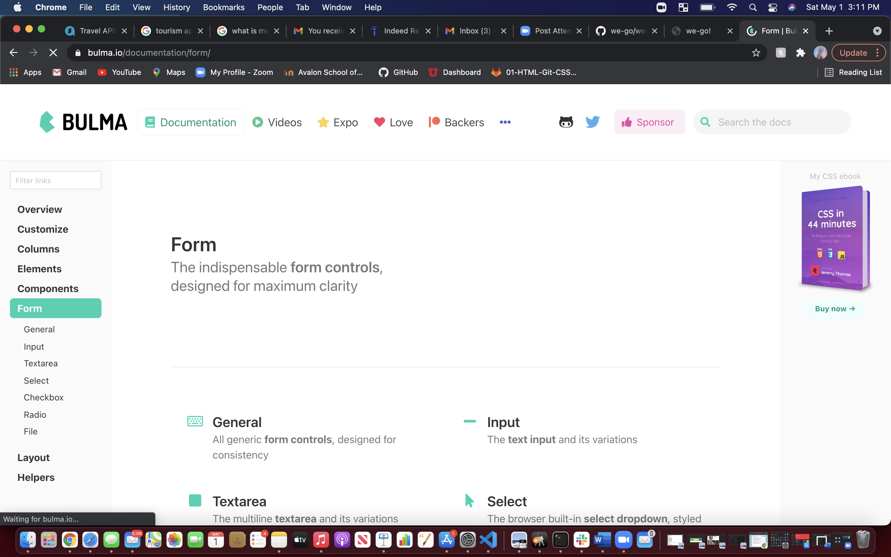

# We-Go
# project-1
Lets make a tourism app!
---
### Table of Contents
- [Description](#description)
- [Introduction](#introduction)
- [Challenges](#challenges)
- [Victories](#victories)
- [Resources](#resources)

---

## Description
We - Go is a tourism application that allows the user to search the weather, points of interest, and tourism in select countries and the cities within the selected country. 

---

## Introduction 
This week we were challenged to create our first project! Our group decided to create a tourism application! 

---

## Challenges

Our groups biggest challenge was really group participation. We started off with 5 team members and ended with two. Regardless we were still able to create an awesome application!

---

Another challenge we ran into was finding API's that were acceptable for this project. We eventually found two that worked perfectly!

Bulma
---

Triposo
---

---

## Victories

We utilized a wire-frame application that helped keep us organized in creating the layout of We-Go.

---

We were able to create "We - Go"! 

---

---

## Resources 

<a href="https://balsamiq.com/learn/">Balsamiq</a>

<a href="https://bulma.io/"> Bulma</a>

<a href="https://github.com/torigonzales/we-go-2">GitHub Repo</a>

<a href="https://www.google.com/">Google</a>

<a href="https://www.triposo.com/api/documentation/20210317/">Triposo</a>

